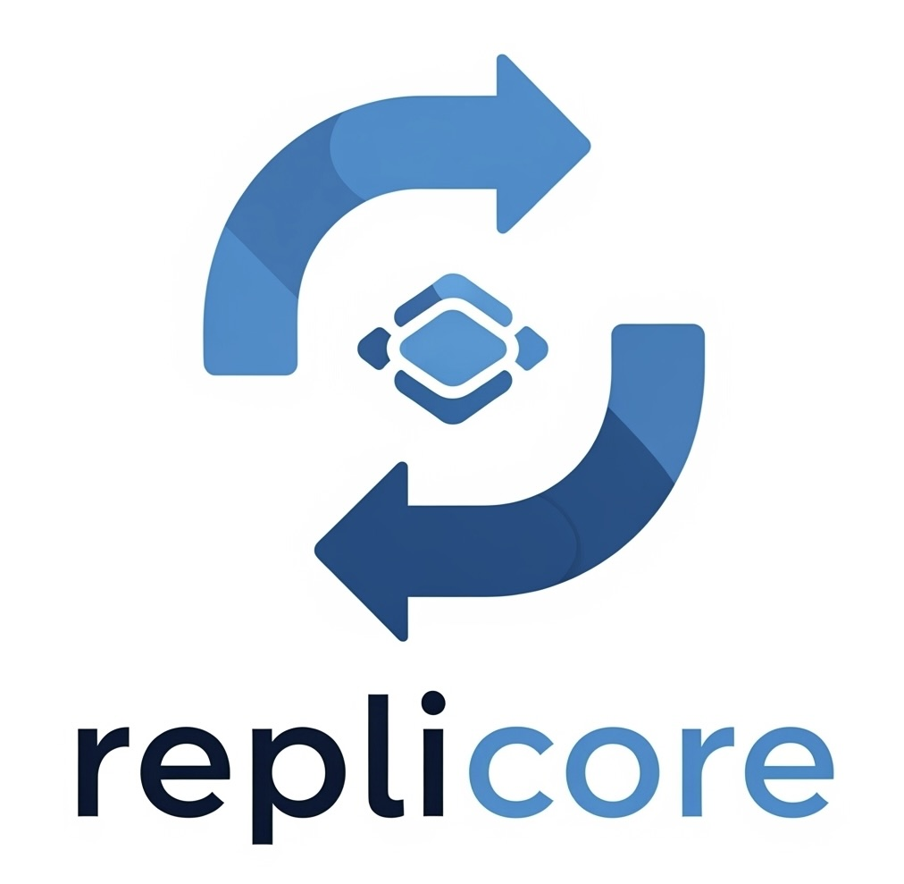

# Replicore - Enterprise Local-First Sync for Flutter



> **Production-ready synchronization engine for offline-capable Flutter applications.**

Transform your online-only Supabase/REST API app into a robust **offline-first platform**. Replicore handles the complexity of bidirectional data synchronization, conflict resolution, incremental syncing, and comprehensive error recovery—so you can focus on building great user experiences.

[](https://pub.dev/packages/replicore)
[](LICENSE)
[](https://flutter.dev)

---

## 🎯 Why Replicore?

Building offline-capable apps is **hard**. Developers struggle with:

- ❌ **Data Consistency**: Keeping data in sync across devices
- ❌ **Conflict Resolution**: Deciding which version to keep when conflicts occur
- ❌ **Network Reliability**: Handling retries, timeouts, and recovery
- ❌ **Monitoring**: Understanding what's happening during sync
- ❌ **Production Readiness**: Error handling, logging, and recovery strategies

**Replicore solves all of this** with a battle-tested, enterprise-grade framework.

---

## ✨ Key Features

### Core Sync Capabilities
- 🔌 **Pluggable Architecture**: Works with Supabase, REST APIs, Firebase, or any backend
- 📱 **True Offline-First**: Seamless transitions between online/offline states
- 🧠 **Smart Conflict Resolution**: ServerWins, LocalWins, LastWriteWins, or Custom strategies
- ⚡ **High Performance**: Keyset pagination, batch operations, transactions (1000+ records/sec)
- 🔄 **Bidirectional Sync**: Pull updates from server, push local changes back
- 🗑️ **Soft Delete Support**: Gracefully handle deletions across devices
- ♻️ **Auto-Migration**: Adds required columns if they don't exist

### Enterprise Features
- 📊 **Comprehensive Monitoring**: Structured logging, metrics, health checks
- 🔐 **Idempotent Operations**: Prevents duplicate writes on network retries
- 🎛️ **Configuration Management**: Production, Development, and Testing presets
- 🔍 **Diagnostics**: Built-in health checks and system diagnostics
- 🛡️ **Error Recovery**: Comprehensive exception hierarchy with strategies
- 📈 **Metrics & Analytics**: Track sync performance, export to external systems
- 🔗 **Dependency Injection**: Fully composable, testable architecture

### 🚀 v0.5.0 - Ecosystem Expansion + Real-Time

**Real-Time Event-Driven Sync (NEW!):**
- 📡 **Real-Time Subscriptions**: Listen to backend changes without polling
  - Instant updates via Firebase Firestore real-time listeners
  - Configurable auto-sync on change detection
  - Smart debouncing to prevent sync storms
  - Auto-reconnection with exponential backoff
  - Battery-friendly (no polling overhead)

**Multiple Storage & Backend Options:**

**📦 LocalStores** (choose based on performance/features):
- 🗄️ **Sqflite** (Default SQLite) - battle-tested
- 🔐 **Drift** (Type-safe SQLite) - compile-time safety
- 📦 **Hive** (Lightweight NoSQL) - zero dependencies
- ⚡ **Isar** (Rust-backed, high-performance) - indexed, real-time

**🌐 RemoteAdapters** (any backend):
- 🔶 **Firebase Firestore** - real-time, offline persistence native
- 🌍 **Appwrite** - self-hosted, open-source BaaS
- 🚀 **GraphQL** - any GraphQL backend (Hasura, Apollo, Supabase GraphQL)
- 💜 **Supabase** (v0.4.0) - still fully supported

**👉 New in v0.5.0**: See [Ecosystem Expansion Guide](docs/v0_5_0_ECOSYSTEM_GUIDE.md) to choose the perfect combination for your needs.

---

## 📦 Installation

Add to your `pubspec.yaml`:

```bash
flutter pub add replicore
```

Or manually:

```yaml
dependencies:
  replicore: ^0.5.0
  sqflite: ^2.4.2
  supabase_flutter: ^2.12.0
```

For other backends, add only what you need:

```yaml
dependencies:
  replicore: ^0.5.0
  
  # LocalStores (pick one)
  drift: ^2.14.0          # For type-safe SQL
  hive_flutter: ^1.1.0    # For lightweight NoSQL
  isar: ^3.1.0            # For high-performance
  
  # RemoteAdapters (pick one)
  firebase_core: ^2.24.0
  cloud_firestore: ^4.13.0
  appwrite: ^11.0.0
  graphql: ^5.1.0
```

---

## 🚀 Quick Start (5 minutes)

### 1️⃣ Setup Flutter and Supabase (Default Option)

```dart
import 'package:flutter/material.dart';
import 'package:path/path.dart';
import 'package:replicore/replicore.dart';
import 'package:sqflite/sqflite.dart';
import 'package:supabase_flutter/supabase_flutter.dart';

Future<void> main() async {
  WidgetsFlutterBinding.ensureInitialized();

  // Initialize Supabase
  await Supabase.initialize(
    url: 'YOUR_SUPABASE_URL',
    anonKey: 'YOUR_SUPABASE_ANON_KEY',
  );

  runApp(const MyApp());
}
```

### 2️⃣ Initialize Replicore

```dart
void main() async {
  WidgetsFlutterBinding.ensureInitialized();
  // ... Supabase initialization ...

  // Open local SQLite database
  final db = await openDatabase(
    join(await getDatabasesPath(), 'myapp.db'),
    version: 1,
    onCreate: (db, version) async {
      await db.execute('''
        CREATE TABLE todos (
          id TEXT PRIMARY KEY,
          title TEXT NOT NULL,
          completed INTEGER DEFAULT 0,
          updated_at TEXT,
          deleted_at TEXT
        )
      ''');
    },
  );

  // Create local store
  final localStore = SqfliteStore(db);

  // Create remote adapter
  final remoteAdapter = SupabaseAdapter(
    client: Supabase.instance.client,
    localStore: localStore,
  );

  // Create sync engine with production config
  final engine = SyncEngine(
    localStore: localStore,
    remoteAdapter: remoteAdapter,
    config: ReplicoreConfig.production(),
    logger: ConsoleLogger(minLevel: LogLevel.info),
  );

  // Register tables
  engine.registerTable(TableConfig(
    name: 'todos',
    columns: ['id', 'title', 'completed', 'updated_at', 'deleted_at'],
    strategy: SyncStrategy.lastWriteWins,
  ));

  // Initialize (idempotent - safe to call multiple times)
  await engine.init();

  runApp(MyApp(engine: engine));
}

class MyApp extends StatelessWidget {
  final SyncEngine engine;
  const MyApp({required this.engine});

  @override
  Widget build(BuildContext context) {
    return MaterialApp(
      home: TodosScreen(engine: engine),
    );
  }
}
```

### 3️⃣ Use in Your UI

```dart
class TodosScreen extends StatelessWidget {
  final SyncEngine engine;

  @override
  Widget build(BuildContext context) {
    return Scaffold(
      appBar: AppBar(
        title: StreamBuilder<String>(
          stream: engine.statusStream,
          builder: (context, snapshot) => Text(snapshot.data ?? 'Ready'),
        ),
      ),
      body: // Your todo list UI
      floatingActionButton: FloatingActionButton(
        onPressed: () async {
          final metrics = await engine.syncAll();
          ScaffoldMessenger.of(context).showSnackBar(
            SnackBar(content: Text(
              metrics.overallSuccess 
                ? '✓ Synced ${metrics.totalRecordsPulled} changes'
                : '✗ Sync failed'
            )),
          );
        },
        child: const Icon(Icons.sync),
      ),
    );
  }
}
```

**Done!** Your app now has offline-first capabilities. ✅

## 🎨 Out-of-the-Box UI Components

Don't reinvent the wheel! Replicore comes with a suite of production-ready, highly customizable Flutter widgets to handle complex sync states, network errors, and offline indicators effortlessly.

### Available Widgets

#### 1. **SyncStatusWidget**
Displays the current synchronization status with an optional manual sync button.

```dart
SyncStatusWidget(
  statusStream: engine.statusStream,
  onSync: () => engine.syncAll(),
  showProgress: true, // Shows CircularProgressIndicator during sync
  builder: (context, status) => Text(status), // Optional custom builder
)
```

**Features:**
- Real-time status updates via Stream
- Optional progress indicator
- Customizable appearance with builder pattern
- Perfect for app bars or status areas

#### 2. **SyncMetricsCard**
Shows detailed synchronization metrics in a beautiful card format.

```dart
SyncMetricsCard(
  metrics: syncSessionMetrics,
  elevation: 2,
  backgroundColor: Colors.white,
)
```

**Displays:**
- Records pulled/pushed counts
- Sync duration
- Conflict count
- Error count
- Overall success status
- Pretty-printed metrics summary

#### 3. **SyncErrorBanner**
Context-aware error banner that automatically handles different error types.

```dart
SyncErrorBanner(
  statusStream: engine.statusStream,
  onRetry: () => engine.syncAll(),
  showDismiss: true,
)
```

**Features:**
- Auto-detects error type (network, auth, schema, server)
- Color-coded by error severity
- Built-in retry button
- Dismissible with auto-hide
- Network/offline state detection

#### 4. **SyncStatusPanel**
Comprehensive dashboard combining all sync UI elements in one place.

```dart
SyncStatusPanel(
  statusStream: engine.statusStream,
  metricsStream: engine.metricsStream,
  onSync: () => engine.syncAll(),
  showMetrics: true,
  showErrors: true,
  showOfflineIndicator: true,
)
```

**Combines:**
- Status display
- Metrics card
- Error banner
- Offline indicator
- Manual sync button

**Perfect for:**
- Settings screens
- Dashboard views
- Comprehensive status pages

#### 5. **OfflineIndicator**
Sleek chip that automatically shows when device is offline.

```dart
OfflineIndicator(
  icon: Icons.cloud_off,
  label: 'Offline',
  backgroundColor: Colors.grey,
)
```

**Features:**
- Only visible when offline
- Customizable icon and label
- Automatic connectivity detection
- Perfect for app bars

#### 6. **SyncButton**
Smart floating action button with automatic loading state during sync.

```dart
SyncButton(
  onSync: () async {
    final metrics = await engine.syncAll();
    print('Sync complete: ${metrics.overallSuccess}');
  },
  icon: Icons.sync,
  loadingIcon: Icon(Icons.hourglass_bottom),
  disabledColor: Colors.grey,
)
```

**Features:**
- Auto-disables during sync
- Custom loading state
- Progress indication
- Error handling

### Full Example: Integrated Sync Dashboard

```dart
import 'package:flutter/material.dart';
import 'package:replicore/replicore.dart';

class SyncDashboard extends StatefulWidget {
  final SyncEngine engine;
  
  const SyncDashboard({required this.engine});

  @override
  State<SyncDashboard> createState() => _SyncDashboardState();
}

class _SyncDashboardState extends State<SyncDashboard> {
  @override
  Widget build(BuildContext context) {
    return Scaffold(
      appBar: AppBar(
        title: const Text('Sync Manager'),
        // Show offline indicator in app bar
        actions: [
          OfflineIndicator(),
        ],
        // Error banner below app bar
        bottom: PreferredSize(
          preferredSize: const Size.fromHeight(50),
          child: SyncErrorBanner(
            statusStream: widget.engine.statusStream,
            onRetry: () => widget.engine.syncAll(),
          ),
        ),
      ),
      body: SingleChildScrollView(
        child: Padding(
          padding: const EdgeInsets.all(16),
          child: Column(
            crossAxisAlignment: CrossAxisAlignment.stretch,
            children: [
              // Status widget
              SyncStatusWidget(
                statusStream: widget.engine.statusStream,
                onSync: () => widget.engine.syncAll(),
                showProgress: true,
              ),
              const SizedBox(height: 16),
              
              // Metrics card
              StreamBuilder<SyncSessionMetrics>(
                stream: widget.engine.metricsStream,
                builder: (context, snapshot) {
                  if (snapshot.hasData) {
                    return SyncMetricsCard(
                      metrics: snapshot.data!,
                    );
                  }
                  return const SizedBox.shrink();
                },
              ),
              const SizedBox(height: 24),
              
              // Manual sync button
              ElevatedButton.icon(
                onPressed: () => widget.engine.syncAll(),
                icon: const Icon(Icons.sync),
                label: const Text('Sync Now'),
              ),
            ],
          ),
        ),
      ),
      // Floating action button for quick sync
      floatingActionButton: SyncButton(
        onSync: () async {
          await widget.engine.syncAll();
          ScaffoldMessenger.of(context).showSnackBar(
            const SnackBar(content: Text('Sync complete!')),
          );
        },
      ),
    );
  }
}
```

### Widget Customization

All widgets support extensive customization through properties:

```dart
// Custom SyncStatusWidget
SyncStatusWidget(
  statusStream: engine.statusStream,
  onSync: () => engine.syncAll(),
  builder: (context, status) {
    // Complete control over rendering
    return Card(
      child: Padding(
        padding: EdgeInsets.all(16),
        child: Column(
          children: [
            Icon(Icons.sync_outlined),
            Text(status, style: TextStyle(fontSize: 18)),
          ],
        ),
      ),
    );
  },
)

// Custom SyncErrorBanner
SyncErrorBanner(
  statusStream: engine.statusStream,
  onRetry: () => engine.syncAll(),
  backgroundColor: Colors.red.shade100,
  textColor: Colors.red.shade900,
  actionColor: Colors.red.shade600,
)
```

---

## ⚙️ Configuration

### Recommended: Production Config

```dart
final config = ReplicoreConfig.production();
// ✓ Large batches (1000 records)
// ✓ Aggressive retries (5 attempts)
// ✓ Longer backoff (up to 5 minutes)
// ✓ Periodic sync enabled
// ✓ Metrics enabled, detailed logging disabled
```

### Development Config

```dart
final config = ReplicoreConfig.development();
// ✓ Small batches (100 records)
// ✓ Few retries (2 attempts)
// ✓ Detailed logging enabled
// ✓ Shorter timeouts
```

### Testing Config

```dart
final config = ReplicoreConfig.testing();
// ✓ Minimal overhead
// ✓ No logging
// ✓ No metrics
```

### Custom Config

```dart
final config = ReplicoreConfig(
  batchSize: 500,
  maxRetries: 3,
  initialRetryDelay: Duration(seconds: 1),
  maxRetryDelay: Duration(minutes: 2),
  enableDetailedLogging: true,
  periodicSyncInterval: Duration(minutes: 10),
);
```

---

## 🧬 Conflict Resolution

When a record is modified locally and remotely, Replicore must decide which version to keep.

### ServerWins (Default)
Remote always wins. Local changes discarded.
```dart
TableConfig(
  name: 'settings',
  strategy: SyncStrategy.serverWins,
  columns: ['id', 'key', 'value', 'updated_at', 'deleted_at'],
)
```
**Use for**: Reference data, administrative settings

### LocalWins
Local always wins. Remote updates ignored.
```dart
TableConfig(
  name: 'drafts',
  strategy: SyncStrategy.localWins,
  columns: ['id', 'content', 'updated_at', 'deleted_at'],
)
```
**Use for**: User drafts, personal notes

### LastWriteWins
Latest modification time wins.
```dart
TableConfig(
  name: 'todos',
  strategy: SyncStrategy.lastWriteWins,
  columns: ['id', 'title', 'updated_at', 'deleted_at'],
)
```
**Use for**: Collaborative data, user-generated content

### Custom Resolver
Your application logic.
```dart
TableConfig(
  name: 'lists',
  strategy: SyncStrategy.custom,
  customResolver: (local, remote) async {
    // Merge logic
    return UseMerged({
      ...remote,
      'merged_field': local['merged_field'],
    });
  },
  columns: ['id', 'name', 'merged_field', 'updated_at', 'deleted_at'],
)
```
**Use for**: Complex data merging

---

## 📊 Monitoring & Observability

### Sync Metrics

```dart
final metrics = await engine.syncAll();

// Overall success
print('Success: ${metrics.overallSuccess}');

// Performance
print('Duration: ${metrics.totalDuration.inMilliseconds}ms');

// Data
print('Pulled: ${metrics.totalRecordsPulled}');
print('Pushed: ${metrics.totalRecordsPushed}');
print('Conflicts: ${metrics.totalConflicts}');

// Pretty-printed summary
print(metrics);
```

### Structured Logging

```dart
// Console logger (development)
final logger = ConsoleLogger(minLevel: LogLevel.debug);

// Multi-logger (integrate with multiple systems)
final logger = MultiLogger([
  ConsoleLogger(),
  SentryLogger(), // Your custom Sentry integration
  DatadogLogger(), // Your custom Datadog integration
]);

final engine = SyncEngine(
  localStore: store,
  remoteAdapter: adapter,
  logger: logger,
);
```

### Health Checks

```dart
final health = await systemDiagnostics.checkHealth();
if (health.isHealthy) {
  print('System is healthy');
} else {
  print('Status: ${health.overallStatus}');
}
```

---

## 🛡️ Error Handling

```dart
try {
  await engine.syncAll();
} on SyncNetworkException catch (e) {
  // Network error (offline, timeout, connection failed)
  if (e.isOffline) showMessage('You appear to be offline');
  else showMessage('Network error: ${e.statusCode}');
} on SyncAuthException catch (e) {
  // Authentication error (session expired, unauthorized)
  redirectToLogin();
} on SchemaMigrationException catch (e) {
  // Schema error (database corruption)
  reportFatalError(e);
} on ConflictResolutionException catch (e) {
  // Custom conflict resolver failed
  logger.error('Conflict resolution failed', error: e);
} on LocalStoreException catch (e) {
  // Local database error
  showMessage('Database error: ${e.message}');
} on ReplicoreException catch (e) {
  // Catch-all for any Replicore error
  showMessage('Sync error: ${e.message}');
}
```

---

## 🏗️ Database Schema

### Required Supabase Columns

All tables must have these columns:

```sql
CREATE TABLE todos (
  -- Application columns
  id UUID PRIMARY KEY DEFAULT gen_random_uuid(),
  title TEXT NOT NULL,
  completed BOOLEAN DEFAULT false,
  
  -- Required by Replicore
  updated_at TIMESTAMP DEFAULT now(),
  deleted_at TIMESTAMP NULL
);

-- Recommended: Index for performance
CREATE INDEX idx_todos_updated_at ON todos(updated_at);
```

### Local SQLite Columns

Replicore automatically adds:
- `is_synced` (INTEGER) - Tracks sync status
- `op_id` (TEXT) - Operation ID for idempotency

---

## 📚 Documentation

| Resource | Purpose |
|----------|---------|
| [ENTERPRISE_README.md](ENTERPRISE_README.md) | Comprehensive feature guide |
| [QUICK_REFERENCE.md](QUICK_REFERENCE.md) | Quick lookup guide |
| [docs/ENTERPRISE_PATTERNS.md](docs/ENTERPRISE_PATTERNS.md) | Best practices & patterns |
| [CONTRIBUTING.md](CONTRIBUTING.md) | Contribution guidelines |
| [CHANGELOG.md](CHANGELOG.md) | Version history |
| [example/](example/) | Full working example app |

---

## 🧪 Example App

See [example/](example/) for a complete working Todo app demonstrating:

- ✅ Supabase authentication
- ✅ SQLite local storage
- ✅ Bidirectional sync
- ✅ Error handling
- ✅ UI integration
- ✅ Metrics display

Run it:

```bash
cd example
flutter run
```

---

## 🔐 Security Best Practices

1. **Row-Level Security**: Enforce RLS policies in Supabase
2. **Auth Token Refresh**: Handle session expiration
3. **Soft Deletes**: Use `deleted_at` for GDPR compliance
4. **Encryption**: Consider encrypting sensitive data at rest
5. **Logging**: Never log authentication tokens or PII

---

## 🔄 Sync Patterns

### Manual Sync
```dart
await engine.syncAll();
```

### Periodic Sync
```dart
Timer.periodic(Duration(minutes: 5), (_) {
  engine.syncAll();
});
```

### Connectivity-Driven Sync
```dart
import 'package:connectivity_plus/connectivity_plus.dart';

Connectivity().onConnectivityChanged.listen((result) {
  if (result != ConnectivityResult.none) {
    engine.syncAll(); // Sync when connection restored
  }
});
```

### User-Triggered Sync
```dart
FloatingActionButton(
  onPressed: () async {
    final metrics = await engine.syncAll();
    // Show result to user
  },
  child: const Icon(Icons.sync),
)
```

---

## 📈 Performance

### Benchmarks

- **Sync 1000 records**: ~500ms (typical)
- **Conflict resolution**: <1ms per record
- **Batch upsert**: ~50-100ms per 100 records

### Tuning Tips

1. **Increase batch size** for fast networks
2. **Add database indexes** on `updated_at`
3. **Reduce logging verbosity** in production
4. **Use `.testing()` config** to disable metrics

---

## 🐛 Troubleshooting

### Sync Doesn't Start
- Check engine is initialized: `await engine.init()`
- Verify tables are registered: `engine.registerTable(...)`
- Check network connectivity

### Data Not Syncing
- Ensure `updated_at` column exists in Supabase
- Verify `is_synced` column added to SQLite
- Check authentication token is valid
- Enable detailed logging to debug

### Conflicts Always Pick Remote
- Verify `strategy: SyncStrategy.lastWriteWins` (not serverWins)
- Check `updated_at` values are populated
- Ensure custom resolver doesn't throw

### Memory Growing
- Call `engine.dispose()` when done
- Reduce batch size for large datasets
- Disable metrics in production if not needed

---

## 🤝 Contributing

We welcome contributions! See [CONTRIBUTING.md](CONTRIBUTING.md) for guidelines.

---

## 📄 License

MIT - See [LICENSE](LICENSE) for details.

---

## 🆘 Support & Contact

- **Documentation**: [ENTERPRISE_README.md](ENTERPRISE_README.md)
- **Examples**: [example/](example/) directory
- **Issues**: [GitHub Issues](https://github.com/leonhardWullich/replicore/issues)
- **Discussions**: [GitHub Discussions](https://github.com/leonhardWullich/replicore/discussions)

---

**Built for teams who demand reliability, observability, and performance. 🚀**

*Replicore v0.2.0 - Enterprise-ready local-first sync for Flutter*
